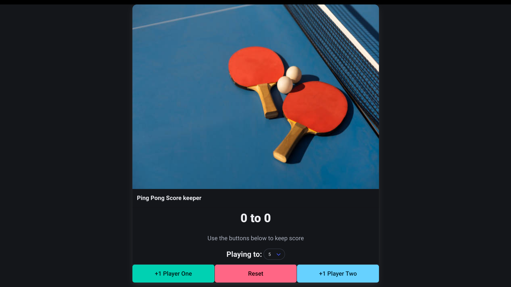

# Ping Pong Score Keeper

A simple HTML/JS project that allows players to keep track of their scores in a Ping Pong game.

Upon reaching the target score, the buttons are disabled to prevent further score adjustments, and the game can be reset for a fresh start.

## Plan to do

- Incorporate a "Win-by-2" functionality to conclude the game when there's a 2-point difference during a tie
- Integrate the ability to subtract points from a specific player's score

